<p align="center">
  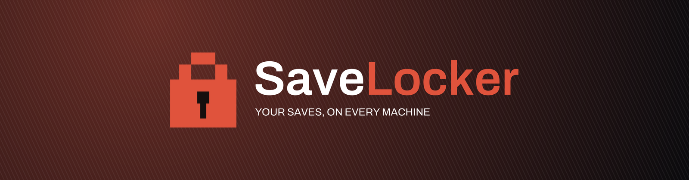
</p>

<p align="center">
  <strong>Self-hosted save-game sync for games without cloud saves.</strong><br>
  Play on your Windows PC, pick up on your Steam Deck — SaveLocker moves the save for you.
</p>

<p align="center">
  <a href="https://github.com/Marwanello/SaveLocker/releases/latest"></a>
  <a href="https://github.com/Marwanello/SaveLocker/actions/workflows/ci.yml"></a>
  
  
  <a href="LICENSE"></a>
</p>

<p align="center">
  <a href="#-getting-started">Getting started</a> ·
  <a href="#-a-tour">A tour</a> ·
  <a href="#-features">Features</a> ·
  <a href="#-how-a-conflict-is-handled">Conflicts</a> ·
  <a href="#-building-from-source">Build</a> ·
  <a href="web/src/releases/0.6.0.md">What's new in 0.6</a>
</p>

<p align="center">
  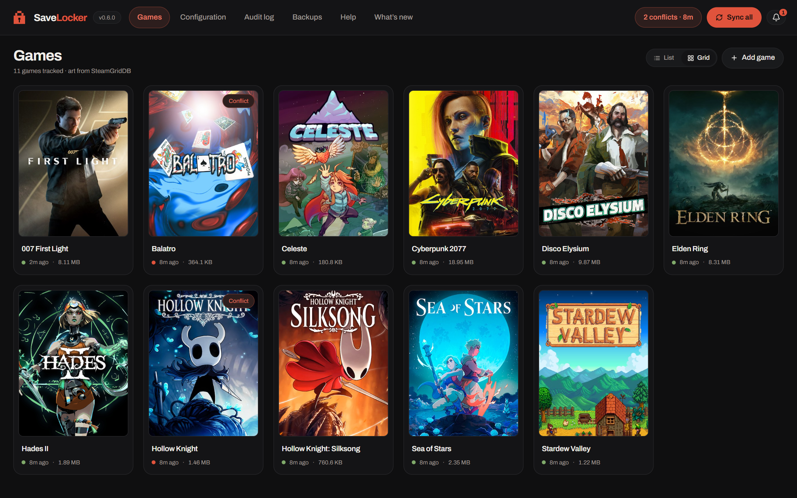
</p>

An agent on each machine watches your save folders, waits for the game to finish writing, and pushes a
versioned archive to a server you host. Before you launch on another machine, it pulls the newest save.
If two machines ever disagree, nothing is overwritten — you get a clear **this device vs. the cloud**
choice, on whichever screen you happen to be looking at.

> **New in 0.6 — the Checkpoint redesign.** One design system across the web console, the agent UI,
> the Windows tray and Steam Deck Game Mode: Archivo type, six accent colours and three app icons the
> whole fleet follows, light and dark themes that follow your OS, **Sync all** with live progress, real
> OS notifications, and a Backups page that can now **restore**. [Read the release notes →](web/src/releases/0.6.0.md)

---

## 🎮 A tour

### The console

The web console is the hub: every game, every machine, every version. It runs in the server container,
so there is nothing to install to use it.

| Game page — versions, machines and save folders | Resolving a conflict — pick a side, keep the other |
|---|---|
| 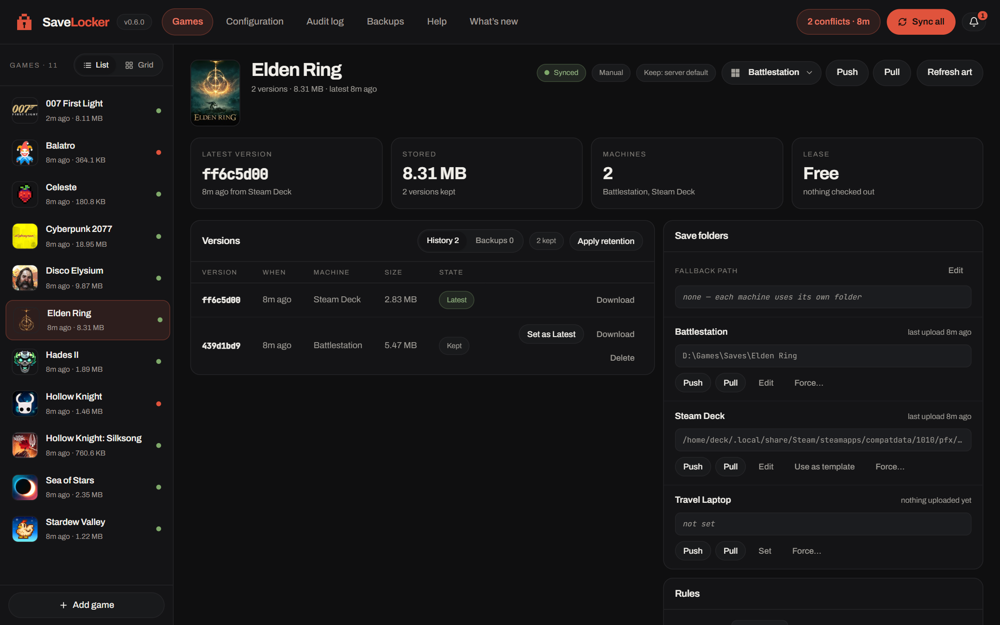 | 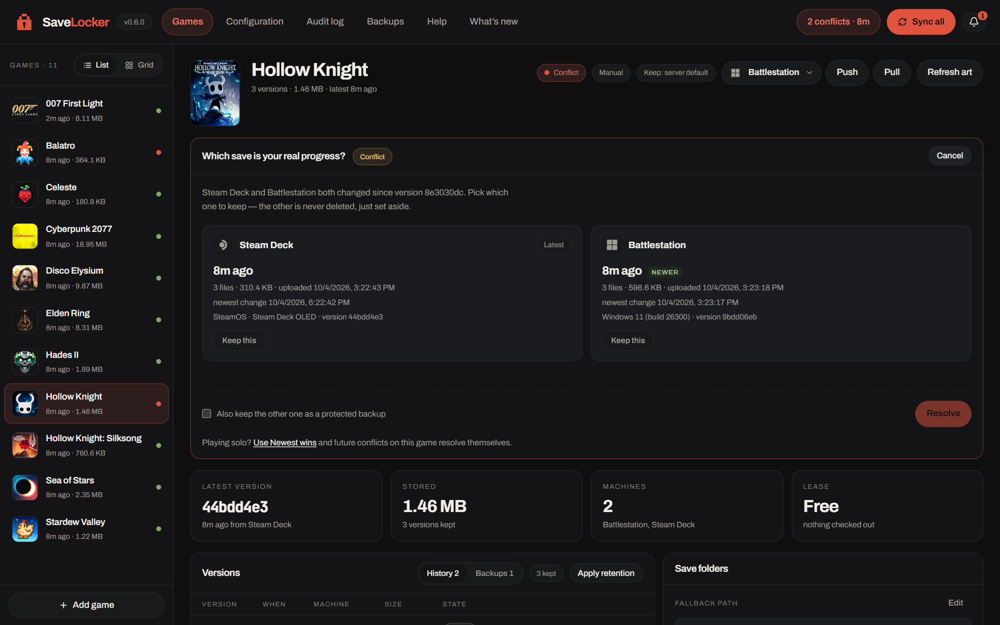 |

| Backups — scheduled, downloadable, restorable | Configuration — appearance, enrollment, defaults |
|---|---|
| 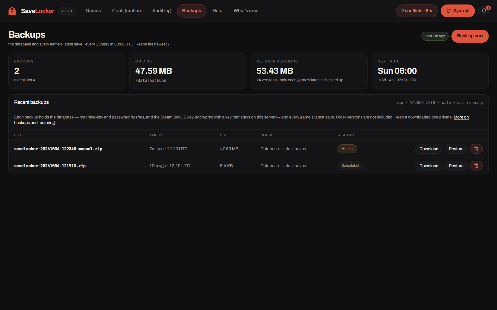 | 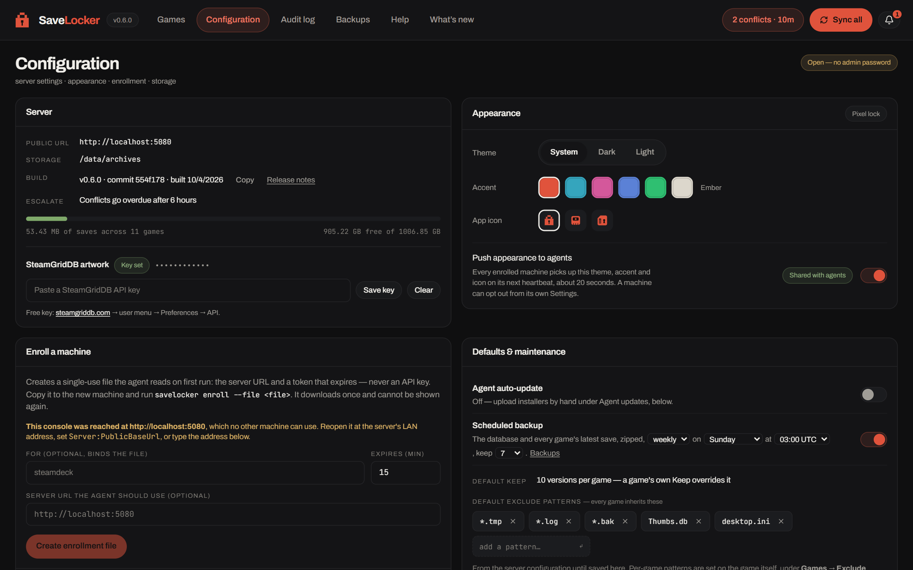 |

<details>
<summary><strong>More: the fleet view and the light theme</strong></summary>
<br>

| Machines — OS, agent version, online status | Light theme (follows your OS) |
|---|---|
| 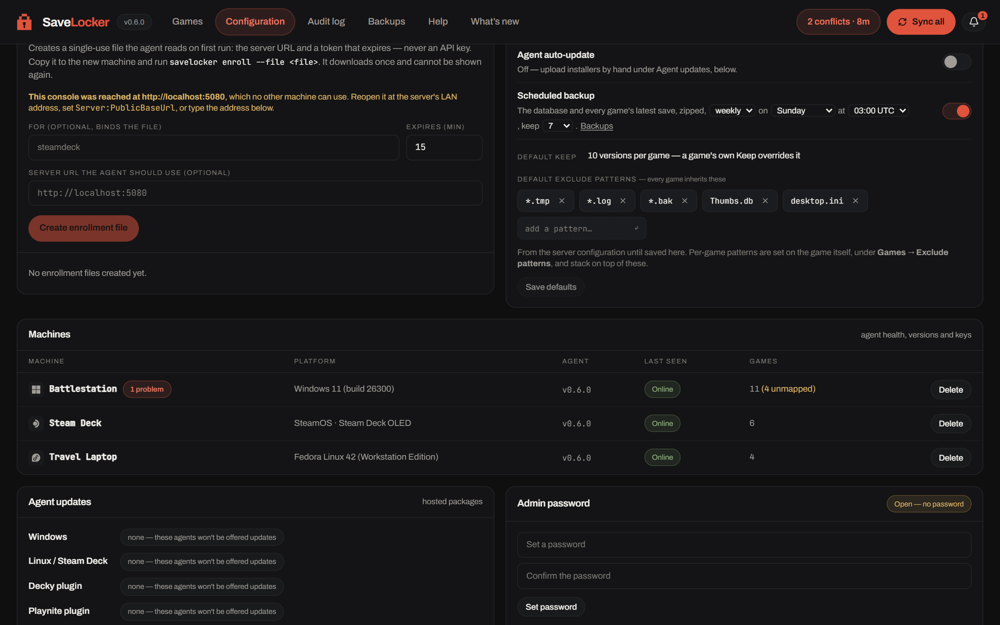 | 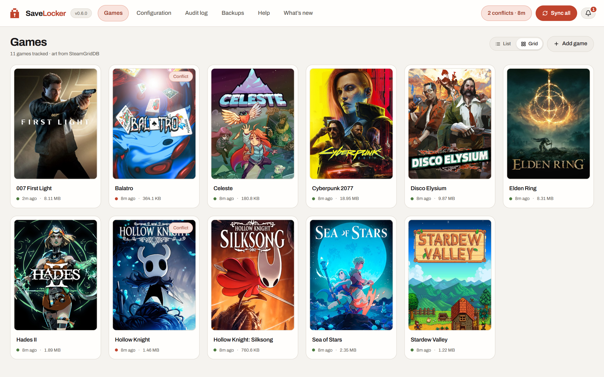 |

</details>

### The agent, on your PC

Each machine runs its own agent with a local UI — a native window on Windows, an app window in Deck
Desktop Mode. It shows only what matters to *this* machine.

| Overview | Games on this machine and on the server |
|---|---|
| 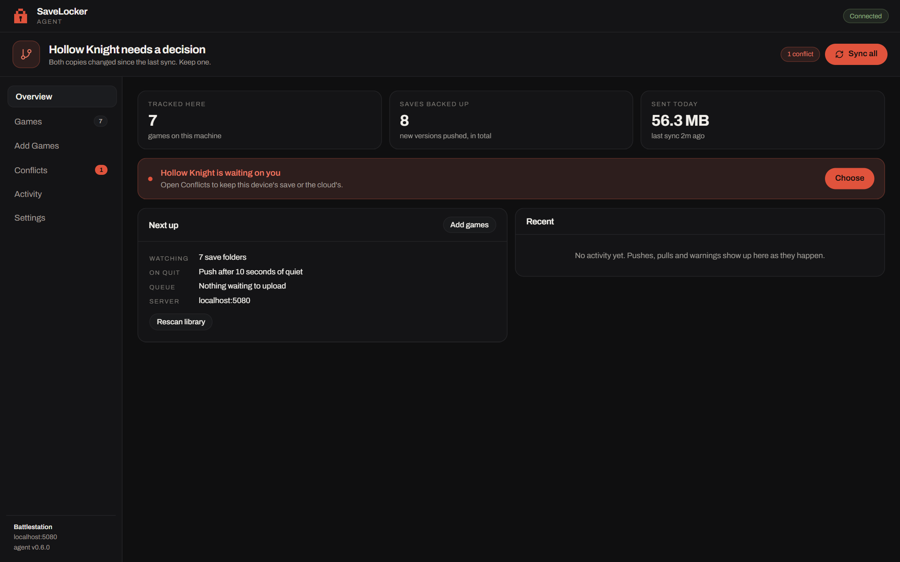 | 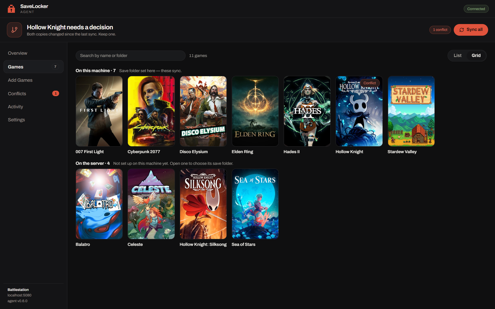 |

| A game's page — sync, push, pull, versions | Conflicts — this device vs. the cloud |
|---|---|
| 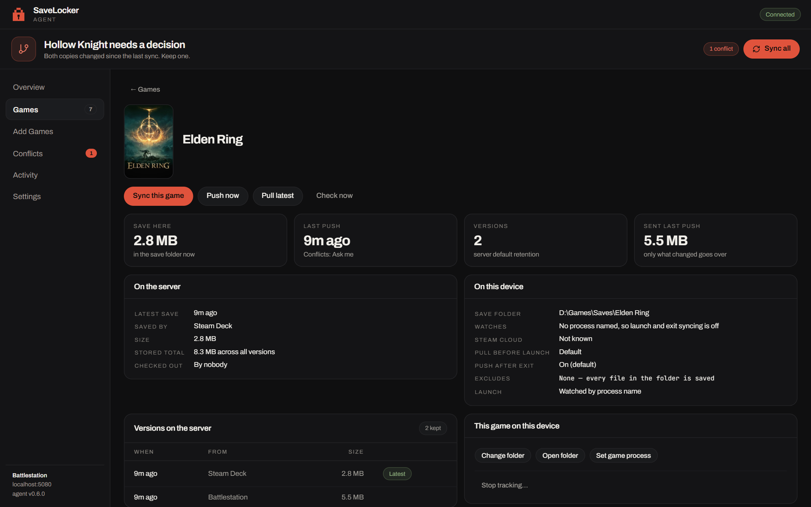 | 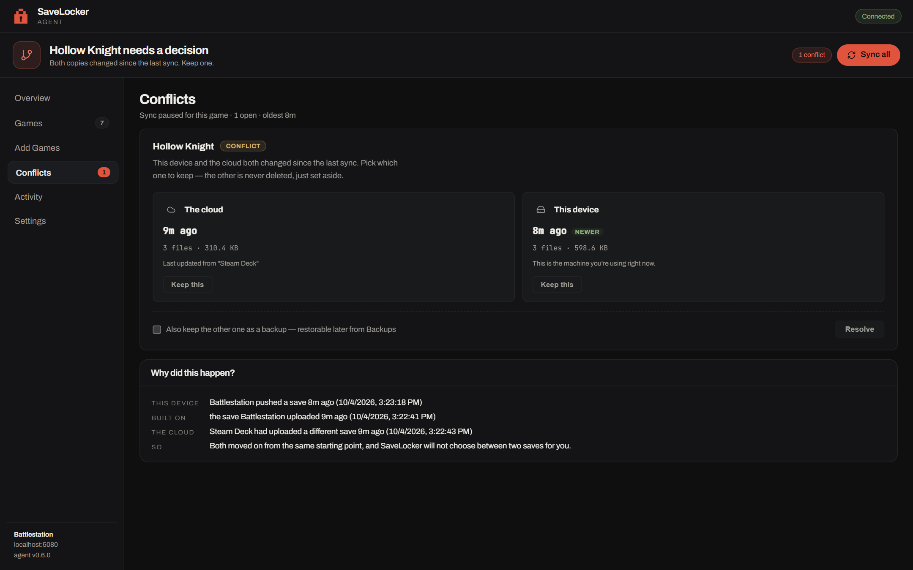 |

### Steam Deck Game Mode

A gamepad-native UI that launches from your Steam library — no keyboard, no Desktop Mode. Cover art,
**Sync all** on <kbd>Y</kbd>, L1/R1 between sections.

| Overview | Tracked games | A game |
|---|---|---|
| 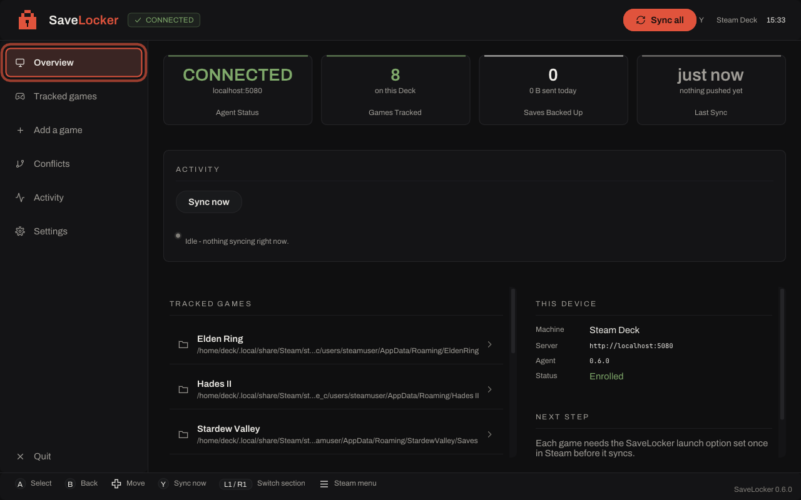 | 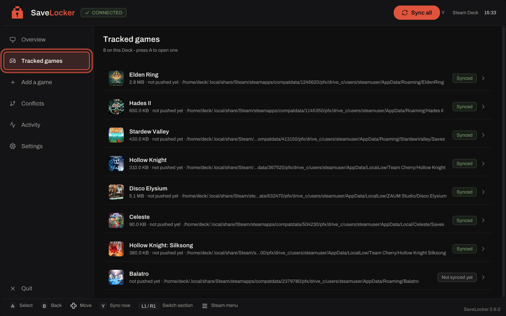 | 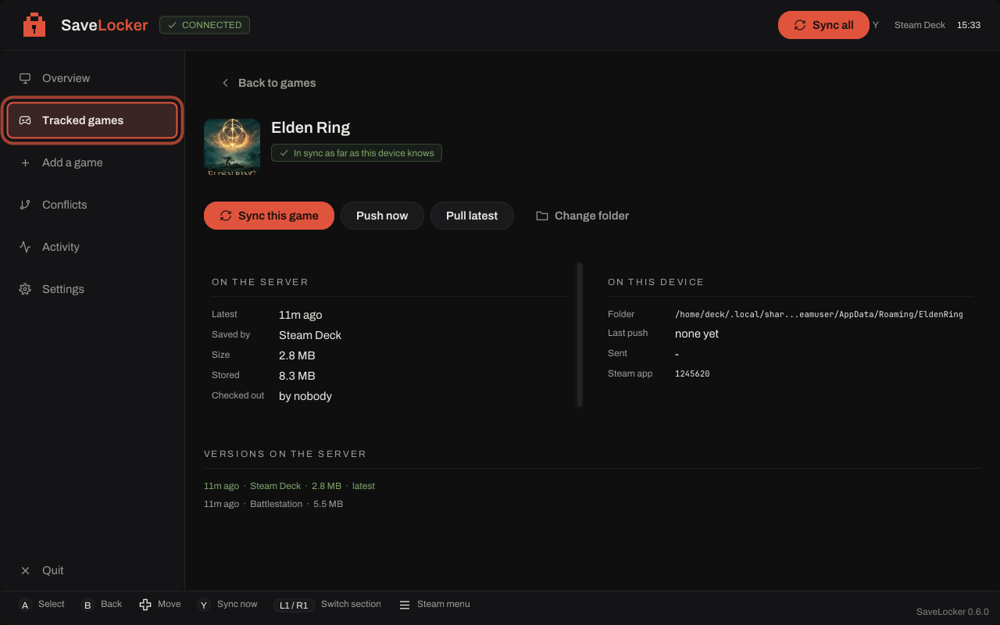 |

<sub>Screenshots are from the project's own test rig. Cover art from <a href="https://www.steamgriddb.com/">SteamGridDB</a>; game titles and art belong to their respective owners.</sub>

---

## ✨ Features

### Sync that stays out of your way

- **Automatic** — watches save folders, waits for the game to stop writing (the *settle gate*), then pushes. Pulls the newest save before you launch.
- **Delta uploads** — only the files that changed since the last push are sent, and large saves upload in small chunks that survive a proxy's request timeout.
- **One save across operating systems** — a Proton save on the Deck and a native save on Windows are the *same save* and round-trip byte-for-byte.
- **Leases** — one machine checks a game out while it runs; another is warned before it can overwrite that progress. Long sessions renew automatically.
- **Offline queue** — a push that fails while the server is unreachable is kept on disk and sent when the connection returns.
- **Sync all** — one button (or <kbd>Y</kbd> on the Deck) syncs every game, with live progress, a Cancel, and a summary that says exactly what happened to each one.

### Nothing gets silently overwritten

- **Conflict detection** — every upload is compared by content hash; a diverged save becomes a conflict and the current version stays untouched.
- **Resolve anywhere** — the console, the agent UI, the Windows tray, Deck Game Mode and the Decky panel all show the same **this device vs. the cloud** card. Keep one side; the other stays as a recoverable backup.
- **Launch gate** — on Linux, a game with a genuine unresolved conflict won't launch until you choose. The Playnite plugin does the same on Windows.
- **Version history** — keep *N* versions per game (default 10), protect the ones that matter, roll back to any of them.
- **Server backups** — the database plus every game's latest save in one zip, on a daily or weekly schedule. Download one, or **restore** it from the console; a safety backup is taken first.

### Finds your games for you

- **Game detection** — the community [Ludusavi manifest](https://github.com/mtkennerly/ludusavi-manifest) resolves save paths for thousands of games; Steam libraries, `shortcuts.vdf`, Proton prefixes, Heroic (Epic/GOG) and Playnite's library are all scanned.
- **Per-machine save paths** — each machine keeps its own folder; the server suggests a canonical one that agents adopt when it exists locally.
- **Exclude patterns** — gitignore-style globs skip logs, caches and screenshots, with a console-editable default list.
- **Cover art** — grids, heroes, logos and icons from [SteamGridDB](https://www.steamgriddb.com/), cached on your server. Pick a different cover from the console.

### Made to run a fleet

- **One-file enrollment** — the console mints a single-use, short-lived policy file; the agent trades it for its own key. No API key is ever copied by hand.
- **Fleet health** — a headless Deck can't pop a toast, so agents report problems to the console: online status, OS, agent version, last sync and queued pushes per machine.
- **Appearance, fleet-wide** — choose a theme, one of six accents and an app icon in the console; every agent, the tray icon and even the Deck's Steam library art follow it.
- **Notifications** — real Windows toasts and Linux desktop notifications for conflicts, with a button straight to the decision.
- **Self-updating agents** — Windows and Linux agents download, verify and install new versions from your server; the Decky and Playnite plugins update through the same channel.
- **Security** — PBKDF2 admin password, revocable console sessions, throttled password attempts, trust-on-first-use TLS pinning, the SteamGridDB key encrypted at rest, and a full audit log.

### Companion plugins

- **[SaveLocker-Decky](https://github.com/SkorcherX/SaveLocker-Decky)** — sets Steam launch options for you (the agent can't: Steam rewrites its own config on exit) and adds a Quick Access panel with sync status, push/pull, conflicts and `doctor`.
- **[SaveLocker-Playnite](https://github.com/Marwanello/SaveLocker-Playnite)** — Windows' answer to the Steam launch wrapper: pulls (or blocks on a real conflict) *before* Playnite starts a game, and pushes after it exits.

---

## 🧭 How it fits together

```
  ┌──────────────────────────────┐
  │  Windows PC                  │
  │  tray agent + agent UI       │◄──┐
  │  folder & process watchers   │   │
  │  (optional Playnite plugin)  │   │       ┌───────────────────────────────┐
  └──────────────────────────────┘   │ HTTP  │  Server  (Docker / unRAID)    │
                                     ├──────►│  ASP.NET Core + SQLite        │
  ┌──────────────────────────────┐   │       │  versioned save archives      │
  │  Steam Deck / Linux          │   │       │  web console · backups · art  │
  │  systemd --user daemon       │◄──┘       └───────────────────────────────┘
  │  Proton launch wrapper       │
  │  Game Mode UI + Decky plugin │
  └──────────────────────────────┘
```

The server is the single source of truth. Agents only make outbound HTTP calls — no inbound ports, so
it works through NAT and firewalls. Each agent polls every ~20 seconds, which is how the console can
ask a machine to push, pull, sync or rescan.

---

## 🚀 Getting started

### 1 — Run the server

The server is a Docker image, built on every commit to `main`. `docker-compose.unraid.yml` in the repo
root is ready to use:

```yaml
services:
  savelocker:
    image: ghcr.io/marwanello/savelocker:latest
    container_name: savelocker-server
    environment:
      - TZ=America/Los_Angeles
      - AgentUpdate__GitHubRepo=Marwanello/SaveLocker
      - AgentUpdate__Plugin__GitHubRepo=Marwanello/SaveLocker-Decky
    ports:
      - "5080:8080"
    volumes:
      - /mnt/user/appdata/savelocker:/data
    restart: unless-stopped
```

```sh
docker compose up -d
# Console at http://<server-ip>:5080
```

<details>
<summary><strong>Environment variables</strong></summary>
<br>

| Variable | Default | Description |
|---|---|---|
| `Storage__DbPath` | `/data/savelocker.db` | SQLite database path |
| `Storage__ArchiveRoot` | `/data/archives` | Save archive directory |
| `Storage__RetainVersionsPerGame` | `10` | Default versions kept per game |
| `SteamGridDB__ApiKey` | *(unset)* | Cover art — set here or in the console |
| `TZ` | *(unset)* | Server timezone — used for the agent-update auto-fetch schedule |
| `Backup__Frequency` / `Backup__DayOfWeek` / `Backup__HourOfDay` | `weekly` / `0` (Sunday) / `3` (UTC) | Backup schedule — also editable on the Backups page |
| `Backup__RetentionCount` | `7` | Backups kept |
| `Ui__Theme` / `Ui__Accent` / `Ui__Mark` | `system` / `ember` / `pixel` | The look — also editable under Configuration → Appearance |
| `AgentUpdate__GitHubRepo` | `SkorcherX/SaveLocker` | Repo checked for new Windows/Linux agent releases |
| `AgentUpdate__Plugin__GitHubRepo` | *(unset)* | Repo checked for Decky plugin releases (e.g. `Marwanello/SaveLocker-Decky`) |
| `AgentUpdate__PlaynitePlugin__GitHubRepo` | `Marwanello/SaveLocker-Playnite` | Repo checked for Playnite plugin releases |
| `AgentUpdate__AutoFetchHours` | `0` (disabled) | Poll the repos above for a newer release this often |

Change the `AgentUpdate__*` repos if you run your own fork and want its releases offered to your fleet.
The server keeps an encryption key ring in `/data/keys` beside the database — back up the whole `/data`
volume, not just the `.db` file.

</details>

### 2 — Create an enrollment file

In the console: **Configuration → Enroll a machine**. Optionally name the machine (that *binds* the file
to it), then download the `.json` policy file and copy it to the new machine. It holds a single-use token
that expires after about 15 minutes — if it does, just make another.

### 3 — Install the agent

**Windows** — download `SaveLocker-Agent-Setup-x.x.x.exe` from
[Releases](https://github.com/Marwanello/SaveLocker/releases) and run it. On the **Enroll this machine**
page, pick the policy file; the machine is online in the console before the installer closes.
(SmartScreen warns because the installer isn't code-signed yet — *More info → Run anyway*.) Unattended:
`Setup.exe /SILENT /ENROLL="C:\path\policy.json"`.

**Steam Deck / Linux** — in Desktop Mode:

```sh
tar -xzf savelocker-x.x.x-linux-x64.tar.gz
./SaveLocker/install.sh
savelocker enroll --file ~/Downloads/policy.json
savelocker doctor            # checks the whole chain — the command to remember
```

It installs under `~/.local/share/SaveLocker` (never `/usr` — SteamOS wipes its rootfs on update),
enables a `systemd --user` service, adds **SaveLocker** to the Desktop Mode application menu, and ships
Steam library art for adding the Game Mode UI as a non-Steam game. To sync a game, set its Steam
**Launch Options** to `/home/deck/.local/bin/savelocker run -- %command%` — or let the Decky plugin do it.

### 4 — Add games

Open the agent → **Add Games**. It scans Steam, Heroic, Playnite and the Ludusavi manifest; tick the ones
you want, set a folder for any it couldn't find, and add them. Games added on one machine show up on the
others at their next poll, ready to have a folder picked.

---

## 🔀 How a conflict is handled

1. **Machine A** launches a game → takes the lease and pulls the latest save.
2. **Machine B** launches the same game → the lease is refused and B is warned. If B plays anyway, its push will land as a conflict.
3. Both push diverged saves → the server records a **conflict** and leaves the current version as it was.
4. The conflict appears wherever you look — console, agent UI, tray, Deck Game Mode, Decky, a desktop notification — always as **this device** vs. **the cloud**, with the newer side tagged. A Linux launch is blocked while it's open.
5. Pick the side that wins. The other is kept as a recoverable backup, and resolving it once clears it everywhere.
6. Every other machine is told to pull the result.

---

## 🛠 Building from source

**Requirements:** .NET 10 SDK, Node 22+, npm.

```sh
git clone https://github.com/Marwanello/SaveLocker.git
cd SaveLocker
```

<details>
<summary><strong>Server and console</strong></summary>
<br>

```sh
cd src/Server
dotnet run              # API + console at http://localhost:5179
```

```sh
cd web
npm install
npm run dev             # proxies /api to :5179 — open http://localhost:5173
```

</details>

<details>
<summary><strong>Windows agent</strong></summary>
<br>

```sh
# Stop the running agent first — it locks the DLLs
dotnet build src/Agent/SaveLocker.Agent.csproj --no-incremental
src/Agent/bin/Debug/net10.0-windows/SaveLocker.Agent.exe          # tray
src/Agent/bin/Debug/net10.0-windows/SaveLocker.Agent.exe status   # CLI
```

The Windows tray (`src/Agent`) and the Linux daemon (`src/Agent.Linux`) are thin hosts over the shared,
platform-neutral sync engine in `src/Agent.Core`. The agent UI is a Vite/React app in `agent-ui/`; MSBuild
builds it and copies `dist/` into the agent output on every build.

</details>

<details>
<summary><strong>Linux / Steam Deck tarball</strong></summary>
<br>

```sh
packaging/linux/build-linux.sh    # self-contained publish → savelocker-<ver>-linux-x64.tar.gz
```

Build on the **oldest glibc you support** (CI uses `ubuntu-latest`). A self-contained .NET binary runs on
newer glibc than it was built against, never older — build on something newer than SteamOS and users get
`GLIBC_2.4x not found`.

</details>

<details>
<summary><strong>Windows installer</strong></summary>
<br>

Requires [Inno Setup 6](https://jrsoftware.org/isinfo.php).

```powershell
.\installer\build-installer.ps1
# Output: installer/dist/SaveLocker-Agent-Setup-<version>.exe
```

</details>

<details>
<summary><strong>Brand assets</strong></summary>
<br>

The Steam library art, favicons and `.ico` files are rendered from SVG sources in
`packaging/linux/artwork/src/` with `npm run export:art` in `web/` (`--check` proves the output is
byte-stable). The README banner and the GitHub social preview live in `docs/brand/`.

</details>

### CI / CD

Every push to `main` builds the console, publishes the server and pushes
`ghcr.io/marwanello/savelocker:latest` — on unRAID, `docker compose pull && docker compose up -d`.
Tagging `vX.Y.Z` builds both agents and attaches them to a GitHub Release, with that version's notes from
`web/src/releases/` as the body. Pull requests run the full matrix, including a **cross-OS round trip**
that hands the server's database and archives between a Windows and an Ubuntu runner to prove a save
survives Windows ↔ Linux byte-for-byte.

---

## 📁 Project structure

```
SaveLocker/
├── src/
│   ├── Shared/         # Wire contracts, content hashing + zip restore, manifest loader
│   ├── Server/         # ASP.NET Core server + EF Core / SQLite (Docker)
│   ├── Agent.Core/     # Platform-neutral sync engine (push/pull, settle gate, enroll, health)
│   ├── Agent/          # Windows tray host (WinForms, WebView2) → Agent.Core
│   └── Agent.Linux/    # Linux daemon, Proton launch wrapper, Game Mode UI → `savelocker`
├── web/                # React console (Vite, TypeScript, Tailwind CSS v4)
├── agent-ui/           # React agent UI — served locally by each agent
├── installer/          # Inno Setup script + wizard artwork
├── packaging/linux/    # Tarball build, install.sh, systemd unit, Steam art sources
├── tests/              # Suites + the testenv throwaway rig
└── docs/               # Project notes, decisions, plans — and the README's screenshots
```

---

## 🗺 Roadmap

- [x] Linux / Steam Deck agent — launch wrapper, daemon, Game Mode UI
- [x] Self-updating agents on Windows and Linux
- [x] Conflict resolution on every surface
- [x] The Checkpoint redesign
- [ ] Emulator save detection
- [ ] Code-signing — no more SmartScreen warning on Windows
- [ ] macOS agent

---

<p align="center">
  <br>
  <sub>SaveLocker is licensed under the <a href="LICENSE">PolyForm Noncommercial License 1.0.0</a>.</sub>
</p>
